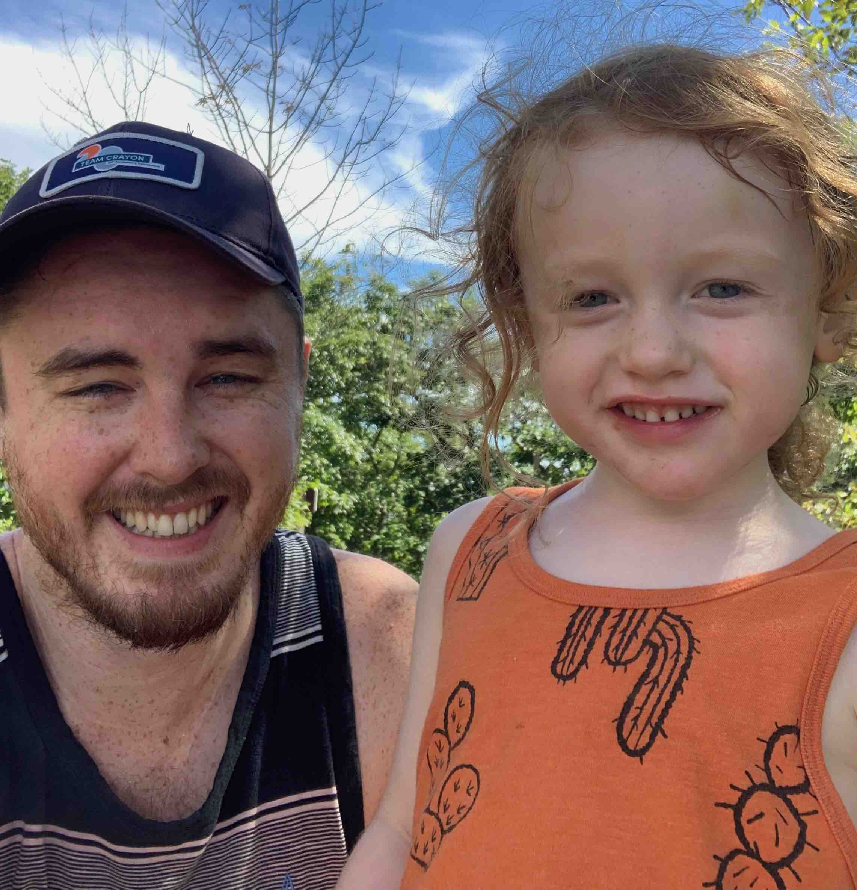

Hi Everyone, 

My name is Joe courtney and I am a Systems Engineer from Massachusetts. I currently work for Dick's Sporting Goods as a Cloud Engineer where I am the work on a team that develops modular cloud infrastructure in Azure.   

In my current role, I wear multiple hats. From orchestrating the development, testing, and deployment of DSG's Azure Terraform modules to creating self-service developer templates using [backstage](https://backstage.io/) and Github actions. My niche is automating everything identity, security, and infrastructure with a focus on Microsoft and RedHat products and services.

I am in the process of honing my programming skills in Golang so I can contribute to open-sourced projects like the azurerm terraform provider but I am just at the beginning of that journey. In the meantime, I will be creating semi-regular blog posts on advanced topics regarding Azure, Terraform, and DevOps...mostly for my own personal records. 

If you happen to find yourself on this site, I hope you can gain a little insight into whatever IT nonsense I decide to write about.

\- Joe Courtney  
Cloud Engineer @ Dick's Sporting Goods

</img>

## Recent Projects

- <a href="https://github.com/blastomussa/crayon-python-sdk">CloudIQ SDK</a>: Python SDK for Crayon's CloudIQ API, PyPi Package, ADO Pipeline
- <a href="https://github.com/blastomussa/Azure-NTier-Terraform">N-Tier Azure Application</a>: Terraform, Flask, Docker, and AKS
- <a href="https://github.com/blastomussa/blastomussa.dev">blastomussa.dev</a>: Personal blog built using Hugo and Blowfish, Docker deployment
- <a href="https://github.com/blastomussa/soap-recipe-api">Soap Recipe API</a>: FastAPI REST API with JWT based Oauth2 implementation and Docker Uvicorn deployment
- <a href="https://github.com/blastomussa/k8s-project">Soap API K8s deployment</a>: Kubernetes deployment of React frontend, Fast API backend, and MongoDB Atlas
- <a href="https://github.com/blastomussa/Password-Generator-Api">Password Generator API</a>: Flask, Docker, Kubernetes, and Jenkins
- <a href="https://github.com/blastomussa/FreshPyService">FreshPyService</a>: Python implementation of FreshService's API

