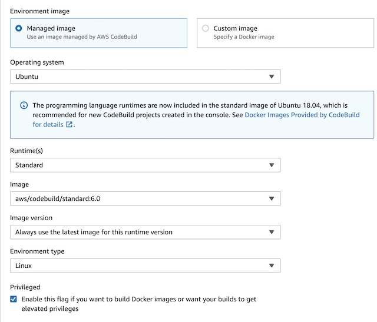
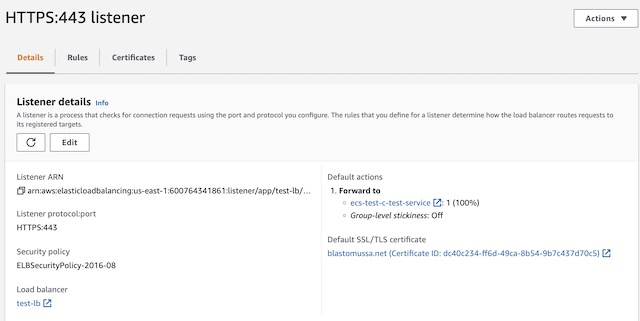
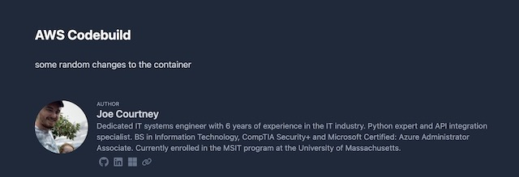
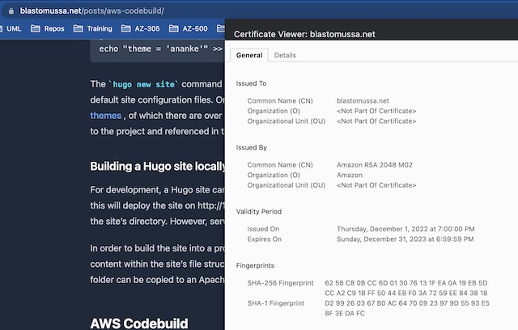

In this article, I will go over the basic principles of building a Docker image using AWS Codebuild. I will be using Hugo, an open-sourced static site generator written in Golang, to create a demo blog. AWS Codebuild will be used to build and test the site. Codebuild will also be used to create a Docker image for the site which will then be pushed to an Elastic Container Registry. 

## Architecture 

When a commit is made to the main branch of my website’s GitHub repository it triggers a GitHub action that uploads a copy of my codebase to an S3 bucket. CodeBuild then runs a pipeline that takes this source code from the bucket, builds it into a Nginx docker image, and uploads the image to an Elastic Container registry. The image is then referenced in an ECS service which deploys the image with AWS Fargate into the target group of an application load balancer. Route 53 provides the public hosted zone for the registered domain, blastomussa.net. AWS Certificate manager provides a valid SSL certificate to the load balancer to secure the site with HTTPS. CloudWatch is set up to collect metrics and trigger an alarm if the ECS instance uses too much memory.

</img>

## Hugo Setup

[Hugo](https://gohugo.io ) is a powerful static site generator that has a reputation for speed and flexibility. One of the project's highlights is its focus on maintaining high SEO scores for the sites that it generates. Sites built using the framework consistently score 100 on performance for both mobile and desktop environments using [Google's Pagespeed tool](https://pagespeed.web.dev/). Pages in Hugo can be written in both Markdown and HTML which allows for the speedy development of content. 

Installing Hugo is straightforward but requires that Golang and Git be installed on the system. macOS users can install Hugo using Homebrew: 
`brew install hugo` and Linux users can use snap: `sudo snap install hugo`. You can also install Hugo from the source using Golang. This method will be used later within the buildspec.yml file used in the Codebuild project.
```
go install -tags extended github.com/gohugoio/hugo@latest
```

### Creating a Hugo site

Once Hugo is installed a site template can be created with a few commands. 

```
hugo new site demo-blog
cd quickstart
git init
git submodule add https://github.com/theNewDynamic/gohugo-theme-ananke themes/ananke
echo "theme = 'ananke'" >> config.toml
```

The `hugo new site` command generates the directory structure needed for the site as well as the default site configuration files. One of the most powerful aspects of the Hugo framework is its use of [themes](https://themes.gohugo.io), of which there are over 400 open-sourced options. Themes can be added as Git submodules to the project and referenced in the config.toml file for use on the site. 

### Building a Hugo site locally 

For development, a Hugo site can be served dynamically using the `hugo serve` command. By default, this will deploy the site on http://127.0.0.1:1313/ and update the site's content with any change to a file in the site's directory. However, serving the site in this way is only meant for development.

In order to build the site into a production ready state, the `hugo` command is used. This compiles the content within the site's file structure into a sub-directory called ***public***. The contents of the ***public*** folder can be copied to an Apache or Nginx instance to serve the site statically. 

## AWS Setup

### S3 Bucket

The first step in setting up the CodeBuild pipeline was to create a S3 bucket that is used to store the current version of the site’s codebase. The bucket is used as the Source in the CodeBuild pipeline. I used Terraform to create the S3 instance because it only required a few lines of code to accomplish. All I needed to do was define an aws_s3_bucket resource block with a bucket name and an aws_s3_bucket_acl defining access to the bucket as public.

```
resource "aws_s3_bucket" "bucket" {
  bucket = "hugo-site-bucket"
}

resource "aws_s3_bucket_acl" "acl" {
  bucket = aws_s3_bucket.bucket.id
  acl    = "public-read-write"
}
```

Once the S3 bucket was created, I added a folder to store the site’s code so the files wouldn’t be synced the root of the bucket. 

</img>

### GitHub Actions

The primary version control used for my site is GitHub. Therefore, I took the opportunity to explore the features that are available in GitHub Actions. I found an action in GitHub’s marketplace that utilizes AWS CLI to sync files from a repository to an S3 bucket. Actions can be triggered any number of events that occur within a repository, so I chose to have the action run with commits to the main branch of the repo. GitHub Actions work much like CodeBuild or a Jenkins pipeline. They run a specified set of commands within a container when they are triggered. I could have setup the entire build using a more complex Action, but this project is focused on AWS so I wanted to save the build for CodeBuild. 

Actions are defined in a YAML file that is saved to .github/workflows/workflow.yml within the root directory of the project. The action itself runs on an Ubuntu container and references the action: https://github.com/marketplace/actions/s3-sync. This specific action also requires several secrets to be set within the repository’s settings including the bucket’s name, an access key ID, and the access key secret. Though it may be poor security practice, I used the same IAM user ID and secret key as I used to configure Terraform. In an actual production environment, I would have created a separate IAM user with least-privilege permissions. The destination for the file sync is set to the blastomussa folder that I created in the S3 bucket. 

```
name: Upload Website to S3

on:
  push:
    branches:
    - main

jobs:
  deploy:
    runs-on: ubuntu-latest
    steps:
    - uses: actions/checkout@master
    - uses: jakejarvis/s3-sync-action@master
      with:
        args: --acl public-read --follow-symlinks --delete
      env:
        AWS_S3_BUCKET: ${{ secrets.AWS_S3_BUCKET }}
        AWS_ACCESS_KEY_ID: ${{ secrets.AWS_ACCESS_KEY_ID }}
        AWS_SECRET_ACCESS_KEY: ${{ secrets.AWS_SECRET_ACCESS_KEY }}
        AWS_REGION: 'us-east-1' 
        DEST_DIR: 'blastomussa/'
```

### Elastic Container Registry

I created the Elastic Container Registry using a Terraform script since it only required a single resource block and minimal configuration. I configured tags to be mutable, meaning that tags can be overwritten. This was important because the image I am pushing to the ECR is always tagged as Latest.  I also configured force_delete to be true which allows the repository to be deleted even if it isn’t empty. This let me use Terraform to tear down the ECR during testing when necessary.

```
resource "aws_ecr_repository" "repo" {
  name                 = "aws-project"
  image_tag_mutability = "MUTABLE"
  force_delete = true
}
```

In order to `docker pull` images from the ECR for testing locally I used the following command with my account number.

</img>

### CodeBuild

CodeBuild serves as the continuous integration pipeline for my website. It builds the site from source code and uploads a customized Nginx container to the ECR. The first step in the process was to choose a Source for the codebase. I chose to use the previously created S3 bucket and the blastomussa/ directory, which GitHub Actions was syncing my site’s GitHub repository to. 

</img>

For the environment, I needed an image that contains the latest version of Golang. The latest version of Ubuntu has all the necessary dependencies preinstalled. Therefore, I went with the standard:6.0 version of Ubuntu that CodeBuild offers as a managed image. Managed images also have the advantage of having docker-in-docker preconfigured which makes using them in CodeBuild simpler than using a custom image. In order to use the docker-in-docker feature the Privileged flag also needed to be checked to give the container the necessary elevated runtime privileges. 

</img>

The next step in setting up CodeBuild was to configure the Service Role. A service role is created by default with the CodeBuild project, but it does not have all of the necessary permissions to upload images to the ECR. In order to do so I found the CodeBuild service role in IAM and added the following ECR permissions to the role.

</img>

After configuring the service role for the project, I needed to set a few environment variables for use in the buildspec.yml file that defines the pipeline. The YAML file references the account ID, the region, the image tag and the ECR repositories name in order to complete the website’s build. 

</img>

The next step in configuring the pipeline was to create the buildspec file which has the series of commands the container will run. The buildspec has three sections: pre-build, build, and post build. In the prebuild, I configured the container to login to the ECR instance. In the build section, the container installs Hugo, builds the site from the source in the S3 bucket, and then builds and tags the docker image. During the post-build phase, the container uploads the image to the registry.

```
phases:
  pre_build:
    commands:
      - echo Logging in to Amazon ECR...
      - aws ecr get-login-password --region $AWS_DEFAULT_REGION | docker login --username AWS --password-stdin $AWS_ACCOUNT_ID.dkr.ecr.$AWS_DEFAULT_REGION.amazonaws.com
  build:
    commands:
      - echo Install Hugo static site generator 
      - go install -tags extended github.com/gohugoio/hugo@latest
      - echo Build static site 
      - hugo -D 
      - echo Build started on `date`
      - echo Building the Docker image...          
      - docker build -t $IMAGE_REPO_NAME:$IMAGE_TAG .
      - docker tag $IMAGE_REPO_NAME:$IMAGE_TAG $AWS_ACCOUNT_ID.dkr.ecr.$AWS_DEFAULT_REGION.amazonaws.com/$IMAGE_REPO_NAME:$IMAGE_TAG      
  post_build:
    commands:
      - echo Build completed on `date`
      - echo Pushing the Docker image...
      - docker push $AWS_ACCOUNT_ID.dkr.ecr.$AWS_DEFAULT_REGION.amazonaws.com/$IMAGE_REPO_NAME:$IMAGE_TAG
```

The Dockerfile used in the build is short but has some important considerations. When I first tried to build the image, I was using the official Nginx docker image from docker.io. This caused my build to fail half the time due to rate limiting. The solution to this problem was to use the official Nginx image from ECR’s public marketplace. This image also specified a different upload location for the website’s content, /usr/share/nginx/html. During the build phase of the pipeline, a new directory called public is created with the website’s static content. The Dockerfile uploads the contents of this directory to /usr/share/nginx/html so it can be served over port 80.
FROM public.ecr.aws/nginx/nginx:latest

```
FROM public.ecr.aws/nginx/nginx:latest
ADD public /usr/share/nginx/html
EXPOSE 80
```

The last step in setting up the CodeBuild project was to enable CloudWatch logging. This allowed me to view detailed logs of the container’s stdout. This was particularly useful when the build failed as it allowed me to dig into the details of the failure. For example, here is the rate limiting error I was receiving when trying to pull the docker hub Nginx image.

</img>

### Network

In order to deploy the ECR image to AWS I needed to create a network infrastructure to support the site. The Elastic Container Service required a VPC and the Fargate container required two subnets. I also had to create a security group that allows HTTP traffic over port 80 so the site can be accessed externally. The primary subnet, subnet_1, also has an internet gateway and route table associated with it to make the container service publicly accessible. I used Terraform to deploy the site’s network infrastructure to AWS. This allowed me to create and teardown the network quickly to make changes during development without clicking around the AWS console. Once created, I could reference the VPC and subnets when deploying the website’s image to ECS. 

```
resource "aws_vpc" "lab_vpc" {
  cidr_block           = "10.0.0.0/16"
  enable_dns_hostnames = true
  enable_dns_support   = true
}
resource "aws_subnet" "subnet_1" {
  cidr_block        = cidrsubnet(aws_vpc.lab_vpc.cidr_block, 3, 1)
  vpc_id            = aws_vpc.lab_vpc.id
  availability_zone = "us-east-1a"
}
resource "aws_subnet" "subnet_2" {
  cidr_block        = cidrsubnet(aws_vpc.lab_vpc.cidr_block, 3, 2)
  vpc_id            = aws_vpc.lab_vpc.id
  availability_zone = "us-east-1a"
}
resource "aws_internet_gateway" "lab-env-gw" {
  vpc_id = aws_vpc.lab_vpc.id
}
resource "aws_route_table" "route-table-lab-env" {
  vpc_id = aws_vpc.lab_vpc.id
  route {
    cidr_block = "0.0.0.0/0"
    gateway_id = aws_internet_gateway.lab-env-gw.id
}}
resource "aws_route_table_association" "subnet-association" {
  subnet_id      = aws_subnet.subnet_1.id
  route_table_id = aws_route_table.route-table-lab-env.id
}
```

### Route 53

Route 53 is used for two important aspects of my project’s infrastructure. The first is domain registration. Route 53 allows users to purchase domain names directly through AWS. Unfortunately, the credit provided did not cover this purchase. However, a .net domain was only $11 for the year so I ate the cost so I could complete the project that I had planned. Registering a domain through Route 53 was very simple. I just needed to find a domain that wasn’t in use and luckily the domain I wanted to use blastomussa.net was available. In order to purchase the domain, I also had to provide some personal details for the ICAAN registration. I believe AWS provides some form of Whois protection, so this information is not public.

</img>

Once registered, AWS automatically creates a hosted zone for the public DNS records for the site. These include the names servers that host the site and the SOA record that shows AWS is responsible for the domain. Once an SSL certificate for the site is created, a CNAME record is also added to the hosted zone to verify domain ownership to activate the certificate. Later in the project, this hosted zone will be configured to host an A record that points to the website’s application load balancer. This A record forwards traffic from the domain to the TLS secured load balancer which sits in front of the website’s container instances. 

</img>

### Certificate Manager

AWS Certificate manager provides free public SSL/TLS certificates that can be used to secure resources. In my case, I am using it to secure the domain blastomussa.net with a certificate so clients accessing the site can connect using HTTPS instead of HTTP. In order to request a certificate, you need to provide three pieces of information: the domain name, the validation method, and the Key algorithm. For the domain name I used blastomussa.net. I had first attempted to use a wildcard certificate *.blastomussa.net but was this was unsuccessful, so I reverted back to the FQDN of the site. I chose the standard RSA 2048 encryption algorithm which is not the most secure option available in ACM but is the most widely used for SSL certificates. I chose DNS validation which allowed me to add a record to the Route 53 hosted DNS zone for blastomussa.net to verify ownership of the domain. In order to the certificate to be validated, ownership of the domain has to be verified. Once the certificate is created there is a button in the certificate’s details that adds the CNAME record to the Route 53 hosted zone directly. This validates and activates the certificate for use with AWS resources. In this case, the application load balancer for the website uses this certificate. This allows encryption to be handled by the load balancer instead of the website's container instances.

</img>

### Application Load Balancer

The Application load balancer for my website was created in AWS’s EC2 dashboard. AWS provides three different load balancing options: application, network, and gateway. The application load balancing option is specifically designed to route HTTP and HTTPS traffic to resources deployed to AWS, therefore it was the obvious choice for this project. When creating the load balancer, I chose to make it Internet Facing and dual stack, meaning it includes both IPv4 and IPv6 IP addresses. I also had to configure the load balancer to use the VPC and the subnets I previously created in the Network section. I did have to tweak the network configuration so that it was viable for use with the load balancer, however. It required the subnets be in different availability zones and it required both subnets to be configured with an internet gateway. Therefore, I added the gateway to subnet_2 and changed its availability zone to us-east-1b. There was also one quirk that I had to contend with while configuring the load balancer. I was required to setup a listener when creating the load balancer and this listener required a target group. The ECS service was not deployed yet and it couldn’t be until there was a load balancer to reference during its creation. I got around this problem by creating a dummy listener and target group with no resources. This allowed me to create the load balancer and continue onto the ECS configuration. Once the ECS service was created with a target group, I was able to delete the dummy listener from the application load balancer. Then I created a new listener referencing the ECS target group and the SSL certificate.

</img>

Once the load balancer was deployed and set up correctly, I had to complete the configuration in Route 53 to ensure that traffic sent to the blastomussa.net domain would be forwarded to the application load balancer. In the blastomussa.net hosted zone, I went to Create a Record → Simple Routing → Define Simple Record. This allowed me to create an A record that routes traffic to the DNS name of the application load balancer.

</img>

### Elastic Container Service 

I chose to use an Elastic Container Service to deploy the containerized version of my website. ECS provides a few different infrastructure models, but I opted to use AWS Fargate which is an AWS managed serverless infrastructure. This seemed to be the best option to run a small website that isn’t heavily resource dependent. The first step in deploying my container to ECS was to setup a cluster. A cluster is a logical grouping of tasks and services. I chose the Networking Only cluster template, so I just needed to supply a name to create the cluster itself.

</img>

The next step in the process was to create a task definition with the container’s configuration. From the ECS console I chose Task Definitions and then Create new Task Definition. The first step was to choose Fargate as the platform the container would run in. Then I needed to give the task a name, choose the default ECS role assignment, and Linux as the container type. I also chose the size of the container instance, .25 vCPUs and .5 Gb of memory which was more than enough to run my static website. The last step in configuring the task definition was to choose the container from my ECR instance. I used the URI from the image details of a container in my registry: 600764341861.dkr.ecr.us-east-1.amazonaws.com/aws-project:latest and gave the container a soft limit of 128mb of memory. I also port mapped port 80 so the website could be accessed on the container over HTTP.

</img>
</img>
</img>

The last step in configure the ECS instance was to create a service that would define how the website’s container would run on the cluster. In the cluster’s Services tab, I clicked Create to get the process started. I chose the Fargate option, the OS type (Linux), the task definition that I created in the previous step, the cluster ECS I created previously, and 1 replica of the container. 

</img>

I configured the service to use Rolling Updates instead of Blue/Green deployment because I didn’t get around to setting up CodeDeploy for the service. Then I needed to configure the networking components of the service. I chose the VPC, subnets, and the application load balancer that I had created in a previous step. Then I configured the container to run behind an HTTPS listener over port 443. I created a target group with the container for the load balancer to point to and setup a health check to ping the root of my website for a 200 response. Once the service was created my website was officially deployed and accessible at https://blastomussa.net/ 

</img>
</img>
</img>
</img>

## Demonstration

To demonstrate my project, I triggered a GitHub action with a new commit to my website’s GitHub repository. In the Actions tab of the repository, I can see the progress and status of the action, a green check signifies a success. If you click into the action, you can see detailed logs of its progress. For example, you can see the commands that were run to upload the repository to the S3 bucket.

</img>
</img>
</img>
</img>

The latest version of the codebase is synced with the S3 bucket. Notice there is no public directory, which will only be created after the site is built in CodeBuild. 

</img>

From the Codebuild console, I can trigger the build manually using the Start Build button for my project. You can view the build history on the project’s details page, and you can view the logs for each run if you click on the individual builds. The container connects to the S3 bucket during the DOWNLOAD_SOURCE phase, builds the website during the BUILD phase, and uploads in to ECR in the UPLOAD_ARTIFACTS phase. The build phase takes a few minutes to complete because Hugo takes a while to install, the build itself only takes a few seconds once the dependencies are installed.

</img>
</img>

Once complete I can see the image that was uploaded to ECR. It is tagged as Latest and the older version of the image becomes untagged. This is why tags for the registry were configured as Mutable. 

</img>

To update the website, I stop the task in the ECR cluster and then the service automatically recreates it with the new version of the container image. This isn’t the most graceful way to do this, but it can be automated with CodeDeploy if necessary. 

</img>

Once the service restarts the task, I am able to see any changes I made to the website. I can also see a valid SSL certificate attached to the site from the Certificate Manager. 

</img>
</img>


The load balancer in this project isn’t really doing any load balancing. It is in place to facilitate the assignment of an SSL certificate to the website and to make use of DNS naming conventions instead of public IP addresses. On the load balancer’s monitoring page, I can see metrics like target response time and number of requests to the website. 

</img>


