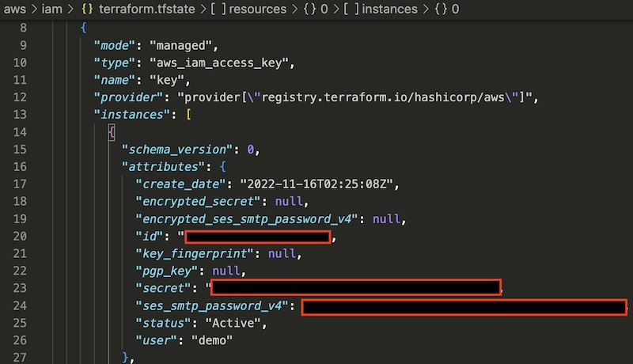

In the following article, I will explore how to create an IAM user in AWS using Terraform. I also experimented with the AWS IAM module to create a policy group with a custom ARN permissions to assign to the user. 

Lab Repository: https://github.com/blastomussa/terraform-labs/tree/main/aws/iam 

```
File Structure
.
├── main.tf
│   
├── iam.tf
│   
├── varaibles.tf
│   
├── terraform.tfvars

```


## Create Terraform deployment

1. Create a **main.tf** file to define the required versions of Terraform and the AWS provider.

    ```
    terraform {
        required_version = ">=0.13"
        required_providers {
            aws = {
            source  = "hashicorp/aws"
            version = "~> 4.0"
            }
        }
    }
    ```

2. Add a provider block to **main.tf** and configure the default region, access key and secret key of registered IAM user.

    ```
    provider "aws" {
        region     = "us-east-1"
        access_key = var.aws_access_key
        secret_key = var.aws_secret_key
    }
    ```

3. Create a **variables.tf** file to define variables for the access key and secret key.

    ```
    variable "aws_access_key" {
        description = "IAM user Access key"
    }

    variable "aws_secret_key" {
        description = "IAM user Secret key"
    }
    ```

4. Create **terraform.tfvars** file to store the actual values of the access key and secret key.

    ```
    aws_access_key = "XXXXXXXXXXXXXXXXXX"
    aws_secret_key = "XXXXXXXXXXXXXXXXXXXXXXXXXXXX"
    ```

5. Create an **iam.tf** file and define a **aws_iam_user** resource block that will create the user. **force_destroy** is set to true to give Terraform full delete management over the user.

    ```
    resource "aws_iam_user" "demo" {
        name = "demo"
        force_destroy = true
    }
    ```

    REF:  https://registry.terraform.io/providers/hashicorp/aws/latest/docs/resources/iam_user

6. Create a **aws_iam_access_key** resource block within **iam.tf** and reference the user from the **aws_iam_user** resource block. This creates a managed access key in AWS that is accessible in the **terraform.tfstate** file after successful deployment.

    ```
    resource "aws_iam_access_key" "key" {
        user = aws_iam_user.demo.name
    }
    ```

    REF: https://registry.terraform.io/providers/hashicorp/aws/latest/docs/resources/iam_access_key

7. Create a module block that references the AWS IAM module

    ```
    module "iam_group_with_policies" {
        source  = "terraform-aws-modules/iam/aws//modules/iam-group-with-policies"

        for_each = {
            tech_support = "arn:aws:iam::aws:policy/AmazonEC2FullAccess"
            design = "arn:aws:iam::aws:policy/AmazonS3FullAccess"
        }

        name = each.key

        group_users = [
            aws_iam_user.demo.name
        ]

        attach_iam_self_management_policy = true

        custom_group_policy_arns = [
            each.value,
        ]
    }
    ```

8. The source is defined as **terraform-aws-modules/iam/aws//modules/iam-group-with-policies** which references a submodule of the official AWS terraform module: https://registry.terraform.io/modules/terraform-aws-modules/iam/aws/latest


9. The **for_each** block defines two seperate policy groups that will be created. The **tech_support** group will have full EC2 access and the **design** group will have full S3 access according to the ARN values in the block. These values are retrieved in the module using the **each.key** and **each.value** variables.

    ```
    for_each = {
        tech_support = "arn:aws:iam::aws:policy/AmazonEC2FullAccess"
        design = "arn:aws:iam::aws:policy/AmazonS3FullAccess"
    }
    ```

10. The **attach_iam_self_management_policy** field adds a role assignement to the group that allows for self management of the group by its members.

11. The demo IAM user is assigned to the policy group using the **group_users** field.

    ```
    group_users = [
        aws_iam_user.demo.name
    ]
    ```

## Deploy to AWS 

1. Run `terraform init` from the root directory of the project to install and lock the required version of the providers defined in **main.tf**.

2. Use `terraform plan` to view the resources that will be created. If you are satisfied with the configuration use `terraform apply -auto-approve` to deploy the resources.

3. To permanently remove all the resources created in this lab run `terraform destroy -auto-approve`.


## Retrieve IAM User's Access and Secret keys

To retrieve the Access key and Secret key for the user you can define an output as follows or look in the **terraform.tfstate** file.

```
output "access_key" {
  value = aws_iam_access_key.key.id
}

output "secret_key" {
  value = aws_iam_access_key.key.secret
}
```

</img>


