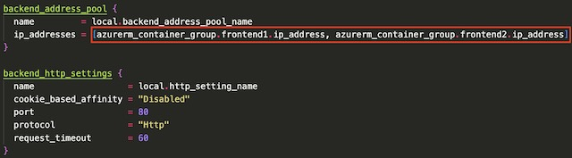

For this project, I deployed a frontend Flask application running on two Azure Container Instances load balanced by an application gateway. The frontend app makes REST API calls to the backend API which is running on an AKS cluster. The backend API then returns a randomly generated password to the frontend which then logs the password to CosmosDB and renders it in HTML for the client. The frontend and backend applications are built as Docker images by an Azure Container Registry task. All resources and alerts are deployed using Terraform. I created my architecture using https://www.diagrams.net, which also has a VS Code plugin for local editing. 

Project Repository: https://github.com/blastomussa/Azure-NTier-Terraform 

</img>

## Azure Services

<table>
    <thead>
        <tr>
            <th>Primary Service</th>
            <th>Resource Name</th>
            <th>Use Case</th>
        </tr>
    </thead>
    <tbody>
        <tr>
            <td>Azure Container Registry</td>
            <td>projregistry5650</td>
            <td>Repository for container artifacts. Includes ACR tasks to build frontend and backend Docker images from GitHub repository</td>
        </tr>
        <tr>
            <td>Azure Container Instance</td>
            <td>frontend-app1, frontend-app2</td>
            <td>Provides a frontend user interface to interact with the backend API. Collects user data and stores sends it to CosmosDB.</td>
        </tr>
        <tr>
            <td>Azure Kubernetes Service</td>
            <td>aks-cluster</td>
            <td>Provides a scalable and highly available backend API running in orchestrated containerized environment. </td>
        </tr>
        <tr>
            <td>Application Gateway</td>
            <td>app-gateway</td>
            <td>Load balance and filter incoming traffic from the public internet to the frontend container instances</td>
        </tr>
        <tr>
            <td>CosmosDB</td>
            <td>mongo-db</td>
            <td>MongoDB instance for collection of user data</td>
        </tr>
        <tr>
            <td>vNet</td>
            <td>azproject-vnet</td>
            <td>Virtual Network resource that contains a subnet for the frontend container instances and subnet for the application gateway. </td>
        </tr>
        <tr>
            <td>Azure Active Directory</td>
            <td>blastomussa.dev</td>
            <td>Authorization for Terraform and Kubernetes</td>
        </tr>
        <tr>
            <td>Log Analytics Workspace</td>
            <td>jcourtneyloganalytics</td>
            <td>Log analytics for AKS cluster</td>
        </tr>
    </tbody>
</table>

## Infrastructure as Code

There are several options for deploying resources to the Azure platform including the Azure portal, Azure-cli, Bicep, and ARM templates. Most of these options are platform dependent and are only applicable within the Azure or Microsoft ecosystems. For this course, I wanted to try a more cloud agnostic approach as we are doing projects on all three major cloud providers. The organization that I work for, Crayon, similarly provides services in Azure, AWS, and GCP. Therefore, I did some research into what tools are being used by our internal cloud engineers and developers. Overwhelmingly the answer was Terraform, a cloud-agnostic provisioning tool designed by HashiCorp. 
Terraform is an infrastructure as code tool that uses a proprietary configuration language known as HCL (HashiCorp Configuration Language) to provision cloud and on-premises resources in a predictable and repeatable way. Terraform allows engineers to apply the principals of version control and CI/CD to cloud infrastructure in a way that supports modern cloud-native applications.

## Deployment

There were many moving pieces to this deployment so the first thing that was necessary was to find the official documentation on using Terraform with Azure on Microsoft’s and HashiCorp’s respective websites. On both sides, I found extremely thorough documentation. Therefore, my goal on this project became to piece together the different aspects of the infrastructure together myself using the documentation as a guide without following one specific instructional or set of instructions. Here are the links to the documentation used in this project.

- Microsoft: https://learn.microsoft.com/en-us/azure/developer/terraform/ 

- HashiCorp: https://registry.terraform.io/providers/hashicorp/azurerm/latest/docs

### Setup

This project requires a few steps to properly configure the local environment to authenticate to Azure, GitHub, and other services correctly. The simplest and quickest way to authenticate Terraform to Azure is to install Azure-CLI and login using an account with administrative privileges. Some of the steps below are specific for macOS. There are other authentication options available here: https://registry.terraform.io/providers/hashicorp/azurerm/latest/docs#authenticating-to-azure 

1.	Install Azure-CLI. 
    1.	`brew update && brew install azure-cli`
    2.	`az login`
    3.	Authenticate with the appropriate Azure admin credentials 
2.	Install Terraform
    1.	`brew tap hashicorp/tap`
    2.	`brew install hashicorp/tap/terraform`
    3.	`brew update`
    4.	`brew upgrade hashicorp/tap/terraform`
    5.	Verify the installation with `terraform -version`
3.	Create a Personal Access Token for the project’s GitHub repository 
    1.	Login to GitHub
    2.	Navigate to the account Settings and Choose Developer in the left-hand menu
    </img>
    3.	Choose Personal Access Token then click the Generate Token button
    4.	On the generation page provide the public_repo and repo:status scopes to the new PAT
    </img>
    5.	Copy the PAT token value and save it in a file named terraform.tfvars 
    </img>
4.	Create a Service Principle for AKS with Azure-CLI
    1.	`az ad sp create-for-rbac --role="Contributor" --scopes="/subscriptions/********`
    2.	Save the appId and password from the output in the terraform.tfvars file
    </img>

### Terraform

Traditionally, Terraform is deployed using three files: main.tf, variables.tf and outputs.tf. However, for this project I split the main.tf file into several different files organized by Azure resource type. As the complexity of this project grew it became necessary to separate resources to improve the readability of the code. This has no effect on how Terraform operates as it finds and parses all files ending with .tf in the root folder of the working directory.

Also included in this project is a terraform.tfvars file, which I mentioned in the setup section. This file allows Terraform to store the values of more sensitive variables, such as those the credentials of the service principle, separate from the variables.tf file. By storing secret values in this way, I was able to keep the tfvars file it out of this project’s public GitHub repository with .gitignore. In the following sections, I am going to go through the various resources that I created for this project. 

#### Variables

One of the advantages of using Terraform is the use of a variables.tf file that contains any variables that may need to be used in the deployment. This file includes variables things like resource names, region, SKUs, client credentials and paths to certificates/keys. These variables can then be referenced while creating resources later in other .tf files within the same directory. Variables can also reference values within the terraform.tfvars file so these values can be used by resources.  

</img>

- https://github.com/blastomussa/Azure-NTier-Terraform/blob/master/terraform/variables.tf 

#### Providers

Terraform interacts with different cloud services using providers. The provider that handles provisioning resources through Azure’s API is azurerm. Any resources that can be provisioned via Microsoft’s proprietary tools can be provisioned through the azurerm provider in Terraform. In order to use azurerm, you need to add it to the provider block of your Terraform code. You can also specify the version of the provider that you would like to use for the project, in this case any version greater than 3.22. For this project, I also needed to include the Kubernetes provider to access the AKS cluster and deploy resources to it.

</img>

- https://github.com/blastomussa/Azure-NTier-Terraform/blob/master/terraform/providers.tf 

#### Resource Group

When using Terraform to deploy resources it is important to deploy them in order of dependance. Therefor the first resource that I created were a resource group for the project. Every other resource within this project requires a resource group to be created so it needs to be created first. In Terraform you can specify the dependance of resources with a depend_on field at the end of the resource definition. The resource group block uses two variables, resource group name and location, to populate the values required to create the resource group.

</img>
</img>

- https://github.com/blastomussa/Azure-NTier-Terraform/blob/master/terraform/resource-group.tf

#### CosmosDB

For this project’s database I decided to use CosmosDB due to its relatively simple implementation of MongoDB. The front-end web app pushes arbitrary client data to the database on every GET request. The application connects to CosmosDB through a MongoDB connection string that is dynamically created from environment variables containing the CosmosDB account name and primary key.

</img>

I created a free-tier CosmosDB account with MongoDB enabled. Since I was using the free SKU of CosmosDB I was limited to certain features and throughput. Therefore, I deployed it is a single region instance with no automatic failover. I also initialized a MongoDB database and collection for documents within the CosmosDB.tf file to ensure that documents sent from the frontend app are stored in the correct location in CosmosDB.

</img>
</img>

- https://github.com/blastomussa/Azure-NTier-Terraform/blob/master/terraform/cosmosdb.tf 

#### Network Resources

This project required several network resources to host the application gateway and frontend app container instances. The network infrastructure consists of a vNet with a CIDR block of 10.0.0.0/16 and two subnets with CIDR blocks of 10.0.1.0/24 and 10.0.2.0/24. This first subnet is assigned to the application gateway and therefor doesn’t require and network security groups or service delegations. The 10.0.2.0/24 subnet on the other hand requires that service delegation from Microsoft.ContainerInstance/containerGroups to Microsoft.Network/virtualNetworks/subnets be setup before deploying container instances to the subnet. The subnet that will house the container instances also has an NSG implemented that denies all inbound traffic except that from the application gateway.

</img>
</img>

The final resources deployed in the Network infrastructure are two network profiles that are later referenced by the frontend container instance resources. This allows the NICs associated with the container instances to be assigned private IP addresses on the frontend-subnet.

</img>

- https://github.com/blastomussa/Azure-NTier-Terraform/blob/master/terraform/network.tf 

#### Container Registry

The container registry for this project builds and stores the Docker images (known as artifacts in Azure) for both the frontend and backend applications. The frontend’s container instances and the backend’s Kubernetes cluster pulls the images from the container registry to deploy the applications within a container/pod. I created the container registry with the Basic SKU which is appropriate for lower usage scenarios. I was also required to admin enable the registry so it could be accessed by Azure Kubernetes Service and Azure Container Instance service. 

</img>

I accomplished the application image build using container registry tasks. By doing so I was able to implement some simple CI/CD concepts to my project. The task that I created builds the application’s Dockerfile from my project’s GitHub repository in a Linux instance. It accesses GitHub using the personal access token created during the setup stage of the project. This PAT is scoped to include the repo’s commit status, so I was able to make the task trigger on every new commit to the master branch of this project. 

</img>

The last step in creating the container registry resources was to trigger the tasks manually so the container instances and AKS cluster would have base application images available for deployment later in the script. 

</img>

- https://github.com/blastomussa/Azure-NTier-Terraform/blob/master/terraform/container-registry.tf 

#### Container Instance

There are two container instances in my project’s infrastructure that run the frontend application. These container instances belong to the backend pool of the application gateway and are not accessible directly from the internet. The first step in creating a container instance resource is to declare its location, OS type, IP address type, and network profile (created in the Network section). I created these container instances in the eastus with private IP address on Linux VMs.

</img>

Next, I used an image_registry_credential block to store the credentials for the previously created container registry.

</img>

Once the registry credentials are properly configured, the container block can pull an image artifact from the container registry during deployment. In the container block, I also declared the CPU and memory usage of the container, along with which port to expose and the details pertaining to a liveliness probe.

</img>

The last step in creating the container instance resource was to inject a number of environment variables into the container instance for use by the Flask application. These variables include CosmosDB credentials, MongoDB database details, the IP address of the backend API and a variable that tells Python which instance the application is running on. 

</img>
</img>
</img>
</img>

- https://github.com/blastomussa/Azure-NTier-Terraform/blob/master/terraform/container-instance.tf 

#### Application Gateway

The application gateway acts as a load balancer for the two frontend application container instances. Public internet traffic can only reach the container instances via the application gateways public IP address. The public IP address is created independently from the gateway and because the gateway is dependent on the IP address, the PIP is created first. I chose to deploy the IP address as static with the standard SKU. 

</img>

There are several reused variables throughout the script so therefore it is best practice to create a block of local variables to be referenced later by the application gateway resource.

</img>

The first steps in declaring an application gateway resource in Terraform are to set the name, location, and resource group of the resource. Then the gateway needs to be assigned a SKU, a gateway IP address configuration, and an autoscale configuration. I chose to deploy this gateway as a Standard_v2 which include features such as autoscaling and zone redundancy. I took advantage of the autoscaling feature by defining a minimum and maximim number of gateway instances. The gateway IP address configuration allows the gateway to be assigned to a particular subnet, in the case the gateway-subnet I created during the networking steps.

</img>
  
The next step in declaring the application gateway resource is to configure the frontend port and associate the gateway with the public IP address created in a previous step. My Flask application is an HTTP application so therefore I chose port 80.

</img>

The backend address pool of the gateway references the IP addresses of the two frontend container instances. I disabled cookie based affinity in the backend settings because my backend API doesn’t use session cookies. Again I set the port to 80 because my Dockerfile specifies that Python runs the application on port 80 instead of the default Flask port 8080. 

</img>

The final step in declaring the application gateway in Terraform was to configure the HTTP listener and the request routing rule. I setup the frontend listener to listen for HTTP traffic on the gateway’s public IP address. There is only one backend pool associated with this gateway so the routing rule type is declared as “Basic” which configures the gateway to forward all requests to the single backend pool. 

</img>

- https://github.com/blastomussa/Azure-NTier-Terraform/blob/master/terraform/application-gateway.tf 

#### AKS Cluster

The AKS cluster in this project hosts the backend API of my n-tier application. Kubernetes and its resources are deployed within virtual machine scale set and its own separate resource group in Azure. None of these underlying resources need to be declared as their deployment and management is handled automatically by Azure when creating the AKS cluster. I am by no means an expert in Kubernetes but in my experience, it was fairly straight forward to setup a simple AKS cluster compared to a local Minikube cluster. I modified the official quick start on AKS using Terraform from Microsoft Learn to build the cluster.

The first step according to the quick start guide is to setup a log analytics workspace for the cluster. I didn’t do anything further with Container Insights on this project, but it is best practice to setup a cluster with a monitoring solution.

</img>

The cluster itself wasn’t that complex to setup because my API is only running on a single node pool. This node pool consists of two nodes that run all of Kubernetes’ internal services as well as my backend Flask API. To begin I declared the name, location, DNS name, and resource group for the cluster.

</img>

Next, I configured the virtual machines that will be used to host the Kubernetes nodes. The node count variable is set to 2 which is the recommended smallest AKS cluster size. I also chose to use Standard_D2_v2 virtual machines for my cluster because that size gave me enough memory to run a stable cluster. I set the SSH key for the virtual machine to my local machine’s public key for password-less remote login to the cluster.

</img>

The last step in setting up the cluster was to define the network profile with a Standard SKU load balance and configure the service principle. The service principle (created during setup) and RBAC enable the cluster to access the Azure Container Registry that hosts an image for the backend API.

</img>

- https://github.com/blastomussa/Azure-NTier-Terraform/blob/master/terraform/aks-cluster.tf 

#### Kubernetes Deployment

The deployment of the backend API to AKS was interesting because Terraform uses a very similar spec to the traditional Kubernetes YAML deployment file. Basically, I was able to modify my existing YAML k8s deployment file to Terraform by adding curly braces. There are a few blocks within the deployment script that I want to highlight. The first is replicas field. This controls the number of pods that are deployed onto the cluster. In this case I specified that four pods of my backend application be running at all times. The next is the Container block which points to the image created by the Azure Container Registry task and exposes port 80. The last block of interest is the resource block which allows you to set limits on CPU and memory usage. In this case, I set the CPU limit for each pod at .5 cores and 512Mi of RAM to ensure that all four pods could run on no more than one underlying 2 core virtual machine.

</img>
</img>
</img>

The last step in deploying the backend API to the AKS cluster is to create a Kubernetes service to expose the backend API’s pods to the cluster’s public load balancer. The service routes traffic from port 80 on the load balancer’s public IP address to the port 80 on the backend API’s pods. This allows the frontend application to make REST calls to the API to retrieve data. 

</img>

- https://github.com/blastomussa/Azure-NTier-Terraform/blob/master/terraform/aks-resource.tf 

#### Outputs

Terraform allows you to define outputs for the deployment in a specialized outputs block that can be used by other scripts or applications. For this project I used three outputs: the public IP address of the application gateway, the resource group name, and the name of the AKS cluster. The IP address output was not required but it allowed me to access the frontend application without looking for the IP address in the portal. The resource group name and AKS cluster name are required to run the command that adds the Kubernetes credentials to my local kubectl configuration file. 

</img>
</img>
</img>

- https://github.com/blastomussa/Azure-NTier-Terraform/blob/master/terraform/outputs.tf 

## Alerting

### Billing Alert

To create the billing alert for this project I also used Terraform, but I did so in a separately initialized directory. This let me keep the billing alert deployed continuously through the project’s testing process. I set an email alert to be sent to my personal email address if my Azure for Student’s subscription reaches 90% of my set budget for this project of $20. I set the time frame of the alert to the months of September and October. 

</img>
</img>

### Resource Monitor Alert

For the resource monitoring section of this project, I chose to deploy a metric alert for one of my container instances, frontend-app1. I deployed the alert via Terraform with the azurerm_monitor_metric_alert resource. The alert sends a critical notification to an action group including my personal email address whenever the average CPU usage of the container instances goes above 1 CPU core in a 5-minute window. I fired the alert by opening a few hundred tabs in Chrome pointing to the application gateways IP address. This caused the CPU usage to shoot to around 2 CPU cores and I received an email after the average usage in a 5-minute window was above 1 core.

In order to make the alert work correctly, I had to scope the alert to the id of frontend-app1. I also had to point the target_resource_type and metric_namespace to Microsoft.ContainerInstance/containerGroups in order to see metrics from container instances.

</img>
</img>
</img>

## Demonstration

The entire infrastructure is deployed using a single command, terraform apply. Terraform validates the configuration and outputs a plan including all resources and corresponding configurations. The infrastructure is deployed once you approve the plan with a ‘yes’ confirmation. This project contains 29 individual resources that are deployed to Azure. 

</img>

The deployment itself takes around 15 minutes to complete, with CosmoDB and the application gateway taking the longest to deploy. Once deployed the application is accessible at the IP address that was outputted by the script. 

</img>

Once connected to the application, the specific container instance that the client is connected to is displayed. This demonstrates how the application gateway routes traffic to the multiple instances of the frontend application.

</img>
</img>

When the Generate Password button is pressed, a GET request is sent to the backend API. The password returned from the API and some client information is then stored in CosmosDB before being displayed to the client on a success page.

</img>

By connecting my local kubectl installation to the AKS cluster, I am able to view the backend pods and their corresponding logs showing a GET request.

</img>
</img>

Finally, I am able to navigate to CosmosDB within the Azure portal and view the document that was created in MongoDB using the Data Explorer.

</img>

