The backend of this project is written in Python using the FastAPI framework and runs on the official python:3.10.7-slim-bullseye Docker image. The frontend of my project is written in JavaScript using the React JS and Tailwind CSS frameworks. The frontend application runs on the official Node version 18.11 Docker container image. Both the frontend and backend containers are deployed in separate namespaces on Kubernetes via a Terraform script. I am using the macOS Docker Desktop implementation of Kubernetes and therefore it is a single node cluster on my local machine. Each app has 3 replicas which are managed by a deployment. Each app also has a service which exposes the apps to localhost on my machine and performs simple round-robin load balancing between the pods. All of the pods also have a shared volume from my local machine mounted at /mnt. The backend app has full CRUD access to a MongoDB Atlas instance running on GCP.

This project was orginally built for the Virtualization project in MSIT 5650: Cloud Computing at UMass Lowell.

## Architecture Diagram

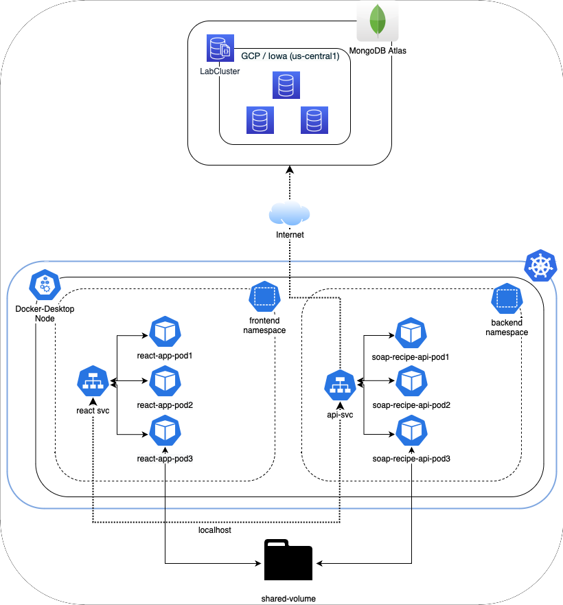</img>

## Links to Project Repositories

1. Backend: https://github.com/blastomussa/soap-recipe-api
2. Frontend: https://github.com/blastomussa/react-app
3. Terraform: https://github.com/blastomussa/k8s-project 

## MongoDB Atlas

The first resource that I configured for this project was MongoDB. At first, I was using a local unsecured instance while I was developing the backend application. However, for the final deployment I wanted something more secure and more robust. Therefore, I chose to explore what Google had to offer for document-based databases. I discovered they have MongoDB Atlas pay-as-you-go service available on their platform. All I needed to do was enable the service API in GCP and navigate to MongoDB to manage the service. In order to manage the service on MongoDB’s platform I had to create an account and I chose to use my Google account as the iDP.

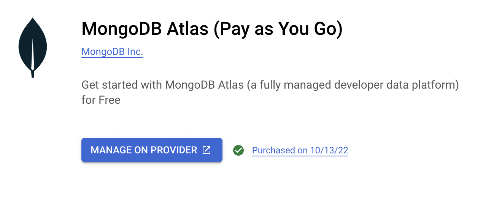</img>

Once I was signed into MongoDB, I chose to create a shared cluster on GCP in the Iowa region. The shared cluster is free and features 512MB of storage over 3 replicas which is suitable for development. 

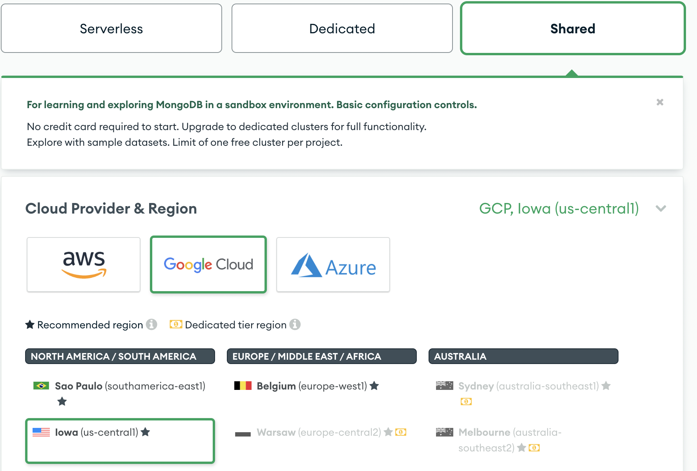</img>

Then I setup an admin user for the database using password authentication. This allows me to connect to the database securely using a connection string. I also configured the IP addresses that are allowed to access the database. As Kubernetes is running on my local machine, I added my home’s IP address to the allowed list.

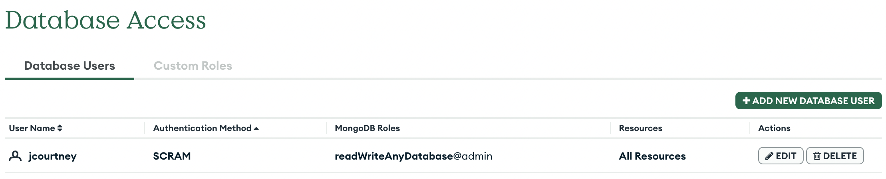</img>
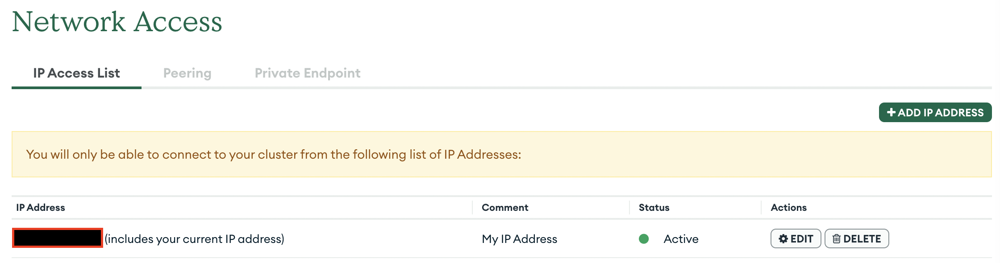</img>

The last step in the process of setting up the database was to retrieve the connection string for the database. MongoDB Atlas has a number of connection options including mongosh, the API and drivers for specific programming languages. I chose to use the driver for Python 3.12. I didn’t need the full code example, so I just copied the connection string for use in my backend application.

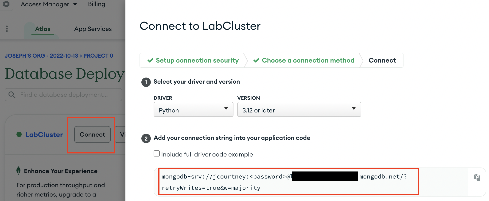</img>

## Backend API

My application’s backend was written in Python 3.10 using the FastAPI framework. This is the first time I used FastAPI but after extensive research into the industry best practices I decided to use the framework over the more familiar Flask framework. FastAPI is a modern, fast (high-performance), web framework for building APIs that creates production ready APIs with auto-generated documentation based on the OpenAPI standard. FastAPI is used internally in large enterprises such as Microsoft, Uber, and Netflix. 

The API that I built is designed to perform CRUD operations on soap recipes. It calculates a recipe from a set of parameters, stores the calculated recipe in MongoDB and then returns the results in JSON form. The API connects to MongoDB through the connection string retrieved previously from MongoDB Atlas. The connection string is saved in a .env file with other secure variables.

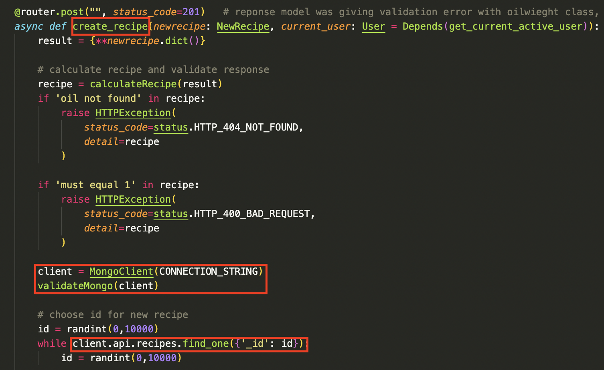</img>
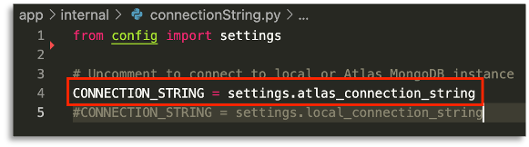</img>

The API also has the full Oauth2 specification implemented with JSON web tokens. As a demonstration later in the project, the frontend will login by making a POST call to the API, which then checks the user’s hashed password in MongoDB to determine if the user is authorized for access and responds with a valid JWT token.

### Dockerfile

- https://github.com/blastomussa/soap-recipe-api/blob/main/Dockerfile 

My goal in containerizing the API was to use industry best practices. Therefore, I chose to run the API on an Asynchronous Server Gateway Interface opposed to a Web Server Gateway Interface or by running it directly in Python. ASGI is the successor to WSGI and intended to provide a standard interface between async-capable Python applications. The recommended ASGI framework for use with FastAPI is Uvicorn, which is a fast, low -level implementation of the ASGI standard. 

With a gateway interface chosen, I could move on to constructing the Dockerfile for the API. For a base image I used python:3.10.7-slim-bullseye. The regular version of the Python image was too large (>1.5Gb) so I opted for the slim version which brought the image down to under 200Mb. The Dockerfile copies requirements.txt from the project’s directory and installs the dependencies using pip. Then it copies the entire project directory into the image and runs the API using Uvicorn. Uvicorn serves the API on 0.0.0.0 port 80 which allows it to be accessed externally while running in a container. The ENV variable injection is left over from testing where I had the API using different settings when running in a Docker container.

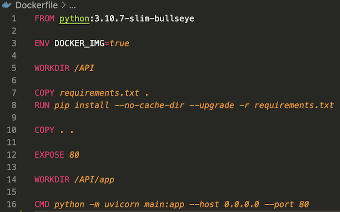</img>
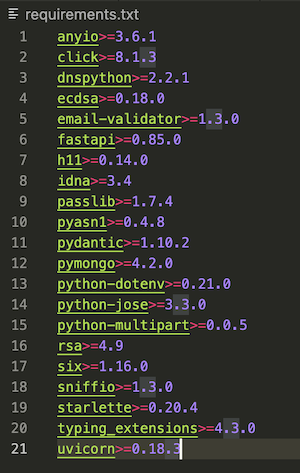</img>

To build the container I used the `docker build -t apiimage .` command from the API’s root directory. This builds the Dockerfile into an image called apiimage. Once it was built, I tested the API using `docker run -d --name apicontainer -p 80:80 apiimage`. If the API was accessible on localhost, I could go on to upload the image to DockerHub. I tagged the image using “docker tag apiimage blastomussa/soap-recipe-api” and pushed the image to DockerHub using `docker push blastomussa/soap-recipe-api`. I was required to log in to DockerHub through Docker Desktop to push the image.

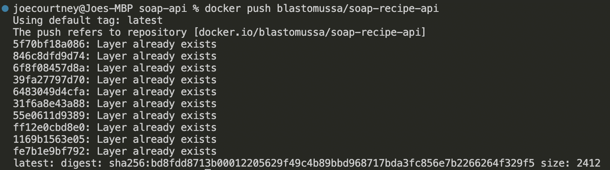</img>
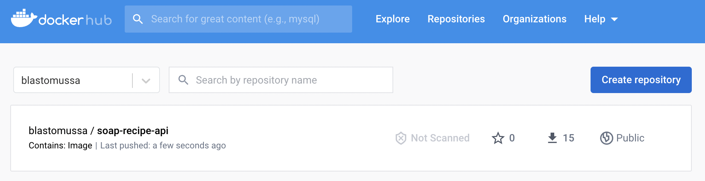</img>

## Frontend Application

For my infrastructure’s frontend, I chose to use the React JS framework with Tailwinds CSS for styling. I have no experience with React and very little with JavaScript, so this aspect of the project was difficult to complete. I was only able to implement the login page of the frontend application in the allotted time due to the complexity of React. In order to create a React app I needed to install Node using Homebrew. I created a template application using the command `npx create-react-app my-app`. Once the app was created, I heavily modified it to make use of the backend API. The app makes calls to the API using the Axios framework. If the user is authorized, the app sets some cookies including the access and refresh tokens before redirecting to the homepage.

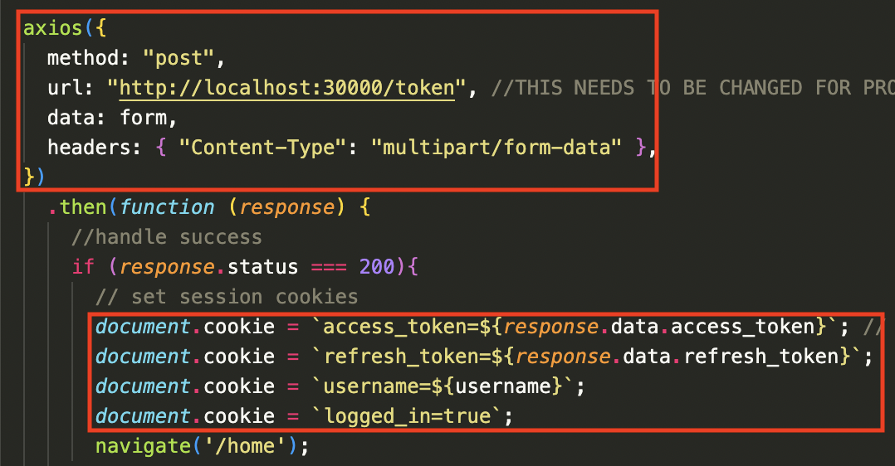</img>

### Dockerfile

- https://github.com/blastomussa/react-app/blob/main/Dockerfile 

Getting the React application to run properly in a Docker container was one of the more difficult parts of the project. I have never tried to deploy a Node application in Docker, so I had several failed attempts before finding a method that worked. First, I tried to run the application as I had while developing it with the `npm run start` command. This looked like it was working from the logs, but when I attempted to deploy the image created this way in Kubernetes it caused the pods to crash. Next, I tried to build the app into a static production ready state using the `npm run-script build` command. I then imported the built application onto Nginx base image. This also looked like it was working but when I attempted to log in to the application it would not redirect properly. Finally, I settled on using “serve -s build” which uses Node to serve the static build of the application. 

I chose to use the official node:18.11 base image to match my development environment. The Dockerfile installs serve with npm and copies the app’s directory from my local machine to the image. Then it exposes the default serve port of 3000 and runs the static server. 

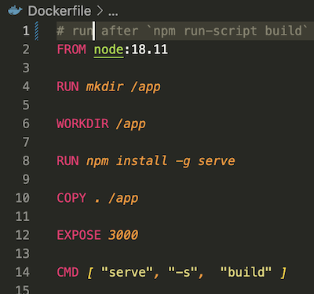</img>

Once I was content with the app’s performance running in container, I pushed the image blastomussa/frontend-react-app using the same method as with the backend API so it could be accessed from the frontend Kubernetes deployment.

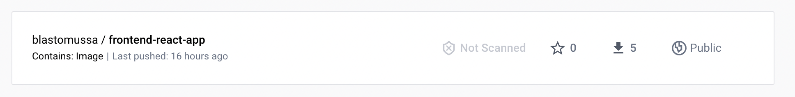</img>

## Kubernetes

Both the backend API and the frontend React app are deployed on Kubernetes using Terraform. I used the version of Kubernetes included with Docker Desktop. I also explored using minikube on a small Linux server I have connected to my local network, but it required more manual configuration than the Docker version. I enabled Kubernetes through Docker’s settings which enables a single-node cluster to run on the local device.

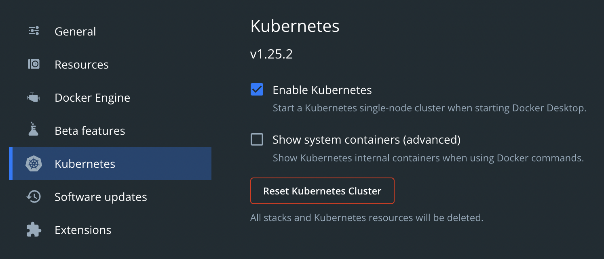</img>

Once enabled, I could view the namespaces associated with the cluster’s control plane and internal components using `kubectl`.  

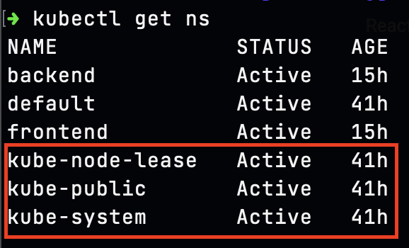</img>
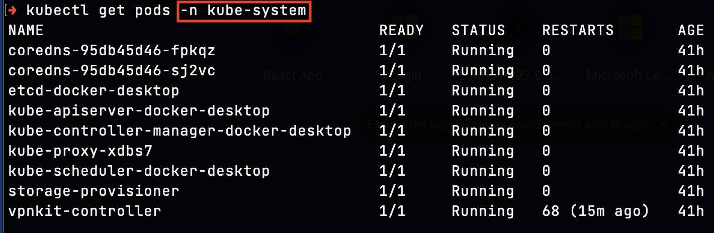</img>

### Provider and Namespace

- https://github.com/blastomussa/k8s-project/blob/main/kubernetes.tf 

The first step in deploying resources to a Kubernetes with Terraform is to configure the Terraform block which configures specific versions of Terraform and required providers. The only provider that is needed for this project is hashicorp/Kubernetes. Once the provider file is saved, you can run “terraform init” on the project’s root directory to lock version information into the project.

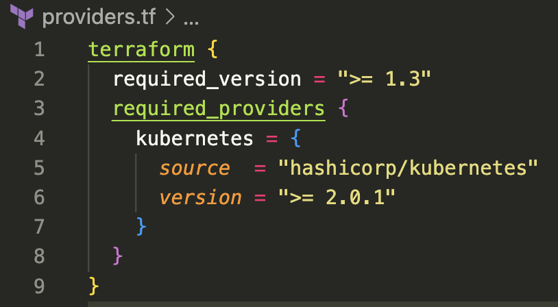</img>

Terraform connects to the Kubernetes cluster by referencing the credentials found in ~/.kube/config. You can also pass credentials from clusters running in the cloud in services such as AKS in the same way. The Terraform Kubernetes provider just needs the host, client certificate, client key, and cluster CA certificate to manage a cluster. Once Terraform is configured to manage Kubernetes the first step in deploying the infrastructure is to create two namespaces for the deployments, frontend and backend. These namespaces logically group the Kubernetes resources associated with each tier of the infrastructure. 

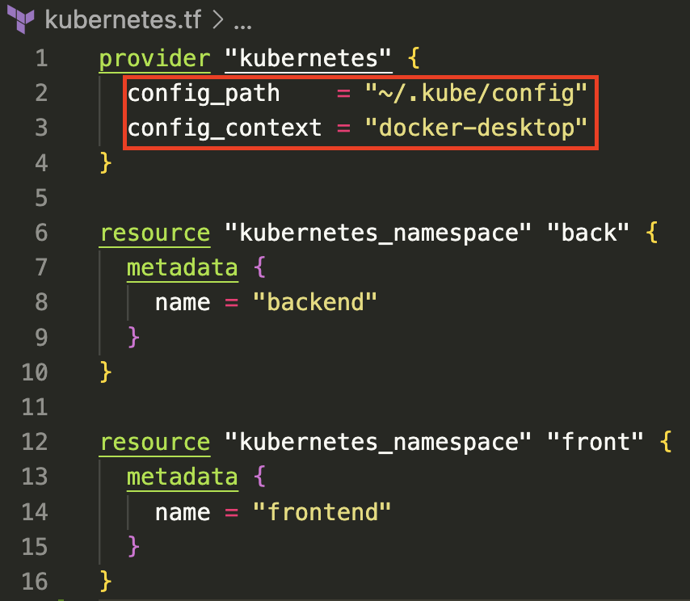</img>

### Backend Deployment

- https://github.com/blastomussa/k8s-project/blob/main/backend-deployment.tf 
    
I created the backend deployment using the kubernetes_deployment resource in Terraform. In the metadata section I configured the name and label for the deployment and the namespace it should be associated with.

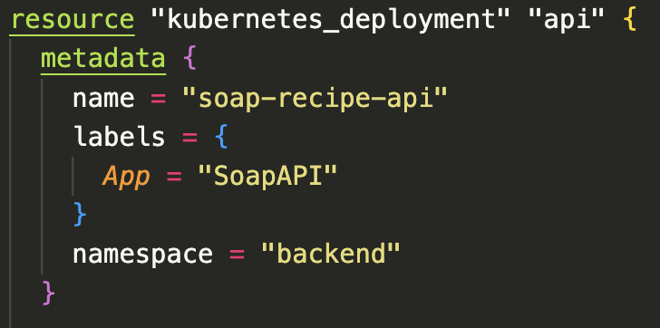</img>

In the container section of the resource block, I configured the deployment to pull an image from my DockerHub, blastomussa/soap-recipe-api:latest. This section also contains the port that the container should expose, a shared volume mounted to /mnt and a liveness probe that probes for status every 10 seconds. The per-pod resource limits are also declared in the container section. These limits are used internally by Kubernetes to kill and reschedule pods that pinged over the defined limit.

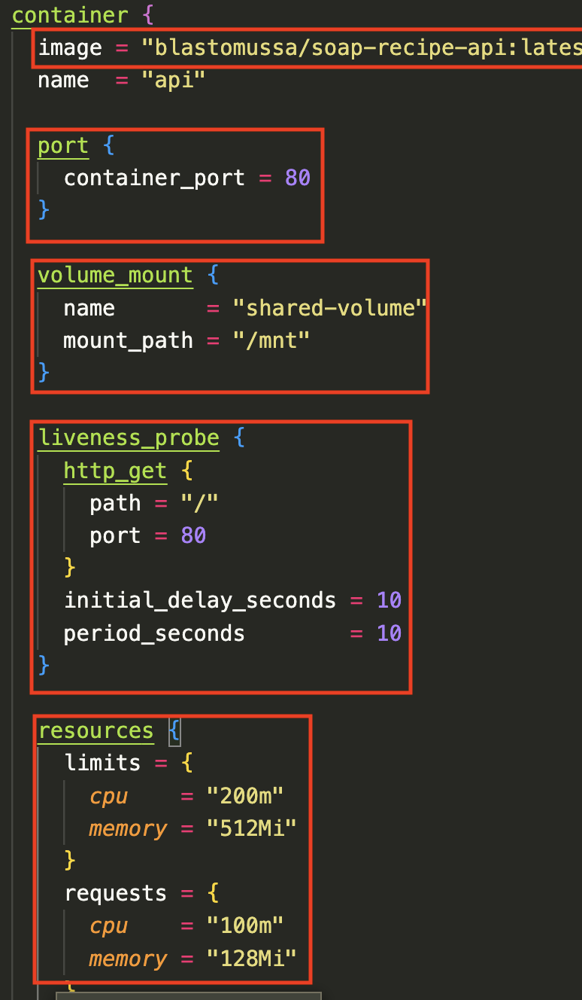</img>

The final part of the backend deployment is a volume that is mapped to a directory on my local machine. This directory is accessible by all scheduled pods and my local machine per this project’s requirements.

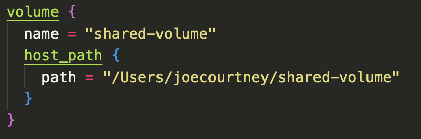</img>

### Frontend Deployment

- https://github.com/blastomussa/k8s-project/blob/main/frontend-deployment.tf 
   
The frontend deployment is almost exactly the same as the backend deployment with the exception of a few key differences. The container image is being pulled from blastomussa/frontend-react-app on DockerHub. The container port is configured to be port 3000 to match the default port of npm’s serve module. I also had to remove the liveness probe from the frontend deployment. It was unable to ping the root of the web app and because of this it was causing the frontend app to crash. Kubernetes uses the liveness probe to kill pods that are stuck or malfunctioning. Since it could not get a valid response from the app, Kubernetes was killing the pods before I could navigate to the app in a browser. I’m sure there is a viable workaround to this problem, but I didn’t want to get bogged down debugging when removing the probe worked well enough. One thing that I did not mention in the backend deployment was the number of replicas that were configured. For each app, I configured 3 replicas, i.e. pods, to host the applications.

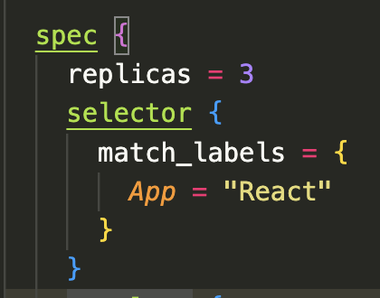</img>

## Services

- https://github.com/blastomussa/k8s-project/blob/main/service.tf

In order to expose the deployments to my local network, I needed to configure a service for each tier of the application’s infrastructure. Kubernetes services route traffic in a round robin fashion to pods running within the cluster. They also map the port that is exposed on the container to a port that can be accessed outside of Kubernetes. Since this is a local cluster, I needed to use NodePort as the service type. The type of service is affected by where the cluster is hosted. In my Azure project for example, I had to define the service as LoadBalancer to successfully deploy my application on AKS. NodePort requires that the mapped port be port 30000 or over so I configured the backend API to use port 30000 and the frontend app to use port 30001.

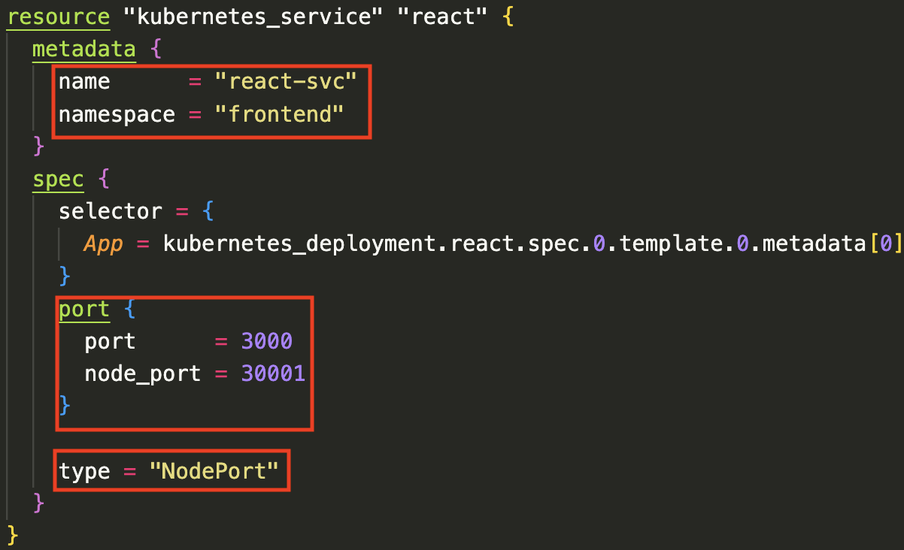</img>
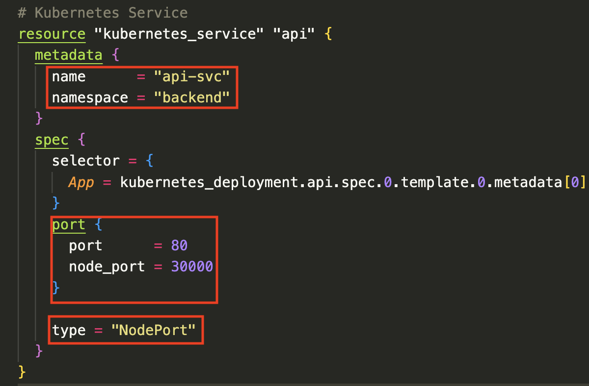</img>

## Demonstration

It only takes a single command to deploy the Kubernetes infrastructure in full, `terraform apply -auto-approve`. This command takes all of the .tf files in the directory and compiles them into a deployment plan. It then executes the plan and deploys the resources.

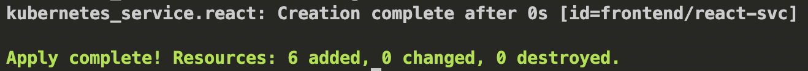</img>

Once the apply is complete I am able to navigate to the API docs page and the React application using the ports that were assigned to them in the service. 

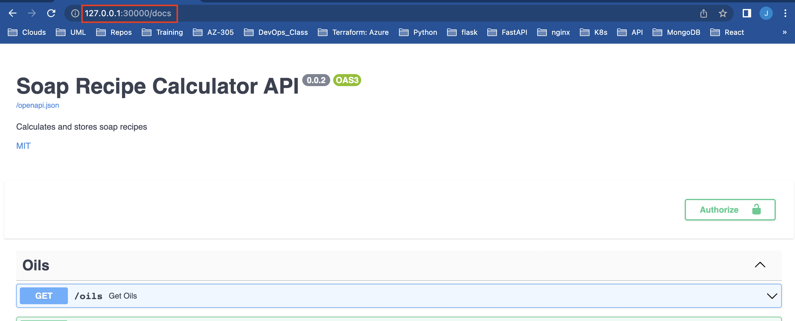</img>
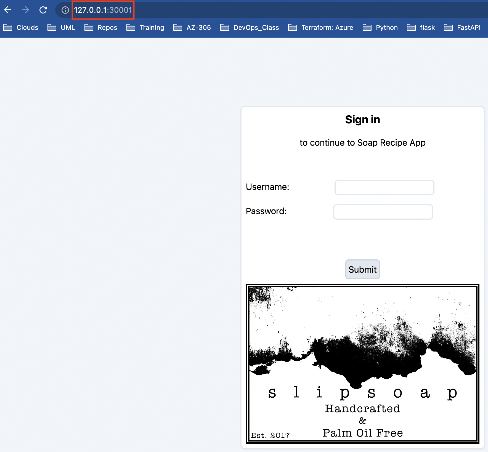</img>

I can login to the application using an admin account I prepopulated into the MongoDB database. If successful it redirects to the apps home page and stores the access token as a cookie.

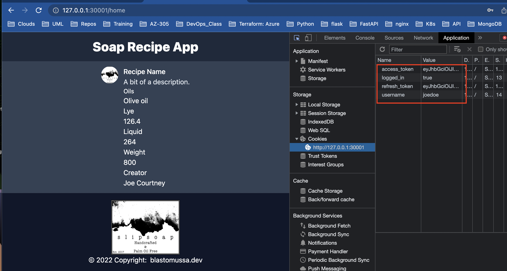</img>

I can see the API request by viewing the logs of the backend pods. You will notice the POST request to the /token endpoint as well as GET requests associated with the liveness probe.

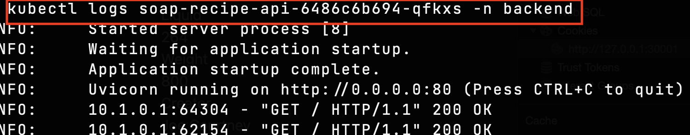</img>
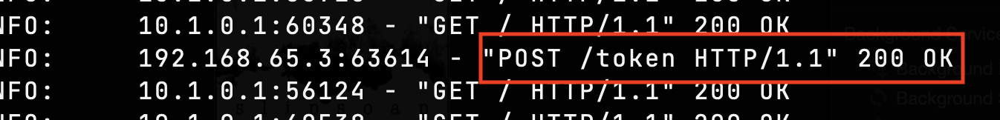</img>

To demonstrate the shared volume, I can remote into running pods from the API and the React app. From there I can cd to /mnt to view a file that I created on my local machine.

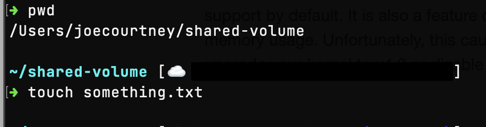</img>
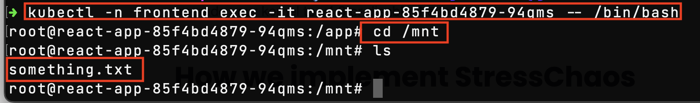</img>
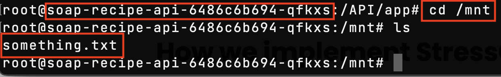</img>

I also attempted a stress test to see if I could get Kubernetes to kill a pod. Unfortunately, I was unsuccessful in getting Kubernetes to kill the pod under stress because the pod itself kept killing the stress process that put it over the limit defined in the deployment file. 

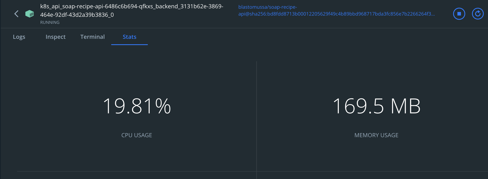</img>
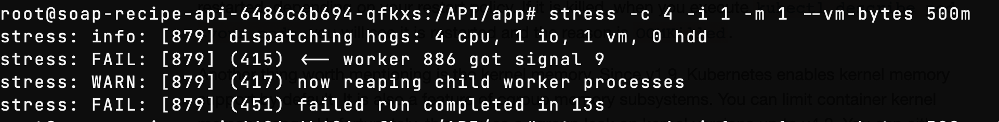</img>

In MongoDB Atlas, I can see the traffic associated with the API making calls to the database. I can also use the collection explorer to view the User document that was used to authenticate the frontend application.

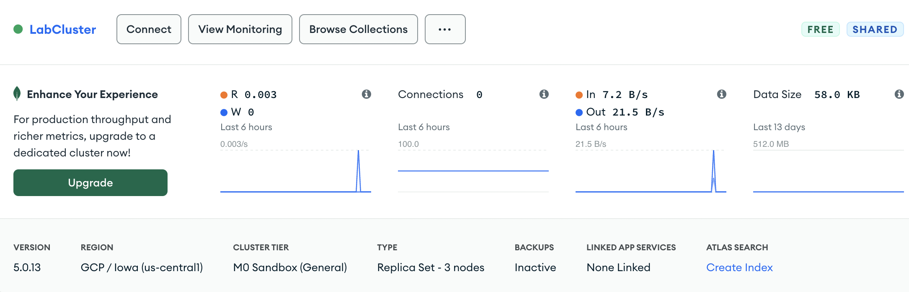</img>
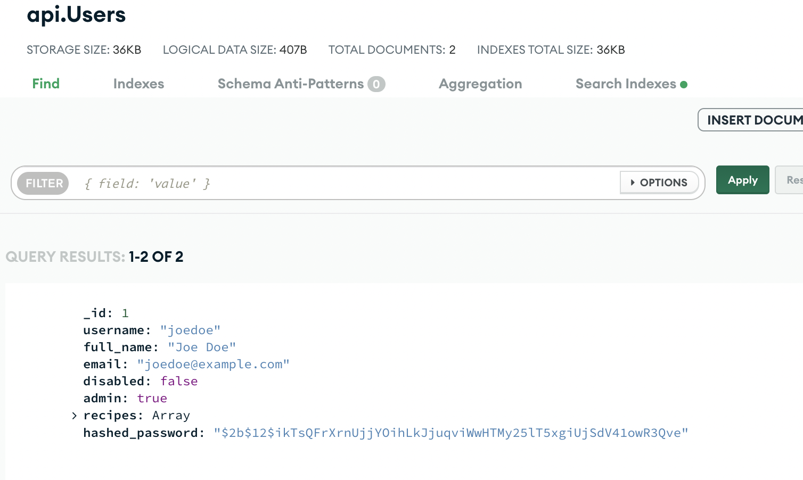</img>

## Conclusion

With this project, I set out to build two custom applications to be run in containers on a Kubernetes cluster. By writing the applications and infrastructure from scratch I feel I gained a more intimate understanding of Kubernetes, containers, and cloud-native applications. There are several things that I wish I had time to accomplish further with this project such as implementing a monitoring solution like Prometheus but that will have to be for another day. I also would have liked to get the frontend application in a more polished state, but I am not a frontend web developer and bit off a little than more I could chew. Overall, however I am very happy with the outcome of this project and the experience I gained in the process of building it. Kubernetes is a very interesting piece of technology that is being used by some of the largest organizations on the planet. It was enlightening to gain some hands-on experience with Kubernetes as it is becoming more important in modern cloud-native IT infrastructure.

## References

- FastAPI: https://fastapi.tiangolo.com/ 
- ASGI: https://asgi.readthedocs.io/en/latest/ 
- Uvicorn: https://www.uvicorn.org/ 
- MongoDB: https://www.mongodb.com/docs/ 
- React JS: https://reactjs.org/docs/getting-started.html 
- Terraform: https://registry.terraform.io/providers/hashicorp/kubernetes/latest/docs 
- Kubernetes: https://kubernetes.io/docs/home/ 

