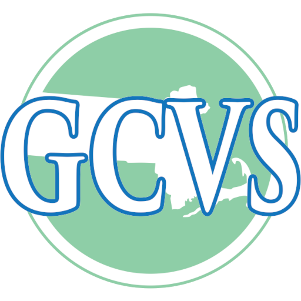

## Experience

<table>
    <thead>
        <tr>
            <th></th>
            <th>Company</th>
            <th>Role</th>
            <th>Dates</th>
            <th>Location</th>
        </tr>
    </thead>
    <tbody>
        <tr>
            <td ></td>
            <td><a href="https://www.dickssportinggoods.com" target="_blank">Dick's Sporting Goods</a></td>
            <td>Systems Engineer II - Azure</td>
            <td>2024 - Present</td>
            <td>Pittsburgh, PA</td>
        </tr>
        <tr>
            <td ></td>
            <td><a href="https://www.umassmed.edu/" target="_blank">UMass Chan Medical School</a></td>
            <td>Azure Cloud Engineer</td>
            <td>2023 - 2024</td>
            <td>Worcester, MA</td>
        </tr>
        <tr>
            <td ></td>
            <td><a href="https://www.crayon.com/us/" target="_blank">Crayon Software Experts, LLC</a></td>
            <td>Senior Technical Support Engineer</td>
            <td>2022 - 2023</td>
            <td>Dallas, Texas</td>
        </tr>
        <tr>
            <td rowspan=2></td>
            <td rowspan=2><a href="https://www.gcvs.org" target="_blank">Greater Commonwealth Virtual School</a></td>
            <td>Tier III Technical Support - Webmaster</td>
            <td>2021-2022</td>
            <td rowspan=2>Greenfield, MA</td>
        </tr>
        <tr>
            <td>&nbsp;&nbsp;Tier II Technical Support</td>
            <td>2020-2021</td>
        </tr>
        <tr>
            <td ></td>
            <td><a href="https://sics.org" target="_blank">Springfield International Charter School</a></td>
            <td>Information Technology Consultant</td>
            <td>2020 - 2021</td>
            <td>Springfield, MA</td>
        </tr>
        <tr>
            <td ></td>
            <td><a href="https://www.sabis.net" target="_blank">SABIS® International Charter School</a></td>
            <td>IT Technician ITL Administrator</td>
            <td>2019 - 2020</td>
            <td>Springfield, MA</td>
        </tr>
        <tr>
            <td ></td>
            <td><a href="https://venturewell.org/" target="_blank">VentureWell</a></td>
            <td>WebEx Facilitator</td>
            <td>2018 - 2019</td>
            <td>Hadley, MA</td>
        </tr>
    </tbody>
</table>

---

## Education

<table>
    <thead>
        <tr>
            <th></th>
            <th>School</th>
            <th>Degree</th>
            <th>Graduated</th>
        </tr>
    </thead>
    <tbody>
        <tr>
            <td rowspan=3></td>
            <td rowspan=3><a href="https://www.uml.edu" target="_blank">University of Massachusetts</a></td>
            <td><a href="https://gps.uml.edu/degrees/grad/online-master-information-technology-degree.cfm">MS, Information Technology</a></td>
            <td>2023</td>
        </tr>
         <tr>
            <td>&nbsp;&nbsp;<a href="https://gps.uml.edu/certificates/grad/online-systems-models-management-graduate-certificate.cfm">Graduate Certificate in Systems Models and Management</a></td>
            <td>2023</td>
        </tr>
        <tr>
            <td><a href="https://gps.uml.edu/degrees/undergrad/online-bachelors-information-technology-degree.cfm">&nbsp;&nbsp;BS, Information Technology</a></td>
            <td>2019</td>
        </tr>
        <tr>
            <td></td>
            <td><a href="https://www.gcc.mass.edu" target="_blank">Greenfield Community College</a></td>
            <td>Associate, Liberal Arts (Jazz)</td>
            <td>2017</td>
        </tr>
    </tbody>
</table>

## Certifications

<table>
    <thead>
        <tr>
            <th>Certification</th>
            <th></th>
            <th>Provider</th>
            <th>Year</th>
        </tr>
    </thead>
    <tbody>
        <tr> 
            <td></td>
            <td>HashiCorp Certified: Terraform Associate (003)</td>
            <td rowspan=1><a href="https://www.hashicorp.com/certification/terraform-associate" target="_blank">HashiCorp</a></td>
            <td>2023</td>
        </tr>
        <tr> 
            <td></td>
            <td>CompTIA Security+ ce Certification</td>
            <td rowspan=2><a href="https://www.comptia.org" target="_blank">CompTIA®</a></td>
            <td>2022</td>
        </tr>
        <tr>
            <td></td>
            <td>CompTIA Network+ ce Certification</td>
            <td>2021</td>
        </tr>
        <tr>
            <td ></td> 
            <td>Microsoft Certified: Cybersecurity Architect Expert</td>
            <td rowspan=7><a href="https://learn.microsoft.com/en-us/users/joecourtney/" target="_blank">Microsoft</a></td>
            <td>2023</td>
        </tr>
        <tr>
            <td ></td> 
            <td>Microsoft Certified: Azure Solutions Architect Expert</td>
            <td>2023</td>
        </tr>
        <tr>
            <td ></td> 
            <td>Microsoft Certified: Azure Security Engineer Associate</td>
            <td>2022</td>
        </tr>
        <tr>
            <td ></td> 
            <td>Microsoft Certified: Azure Administrator Associate</td>
            <td>2022</td>
        </tr>
        <tr>
            <td ></td>
            <td>Microsoft Certified: Security, Compliance, and Identity Fundamentals</td>
            <td>2022</td>
        </tr>
        <tr>
            <td ></td>
            <td>Microsoft Certified: Azure AI Fundamentals</td>
            <td>2022</td>
        </tr>
        <tr>
            <td ></td>
            <td>Microsoft Certified: Azure Fundamentals</td>
            <td>2021</td>
        </tr>
    </tbody>
</table>

